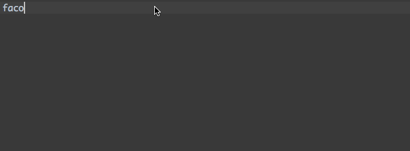
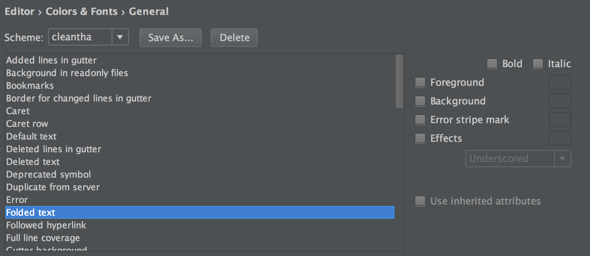
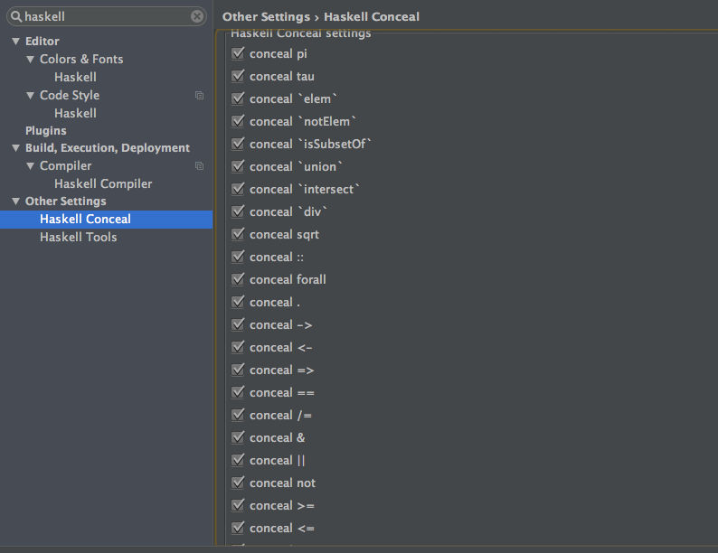

## Haskell Conceal Plugin

https://plugins.jetbrains.com/plugin/8268

## Snapshots

## Shortcuts

* ⇧⌘- (Collapse All)

* ⇧⌘+ (Expand All)

## Configuration

* it's better to clear Foreground and Background color for Folded text.

* to turn on or turn off specific conceal.

## Development

* `./gradlew runIdea`
* `./gradlew buildPlugin`
* `./gradlew test`

## Known Issues

* [unicode bug in Intellij IDE Editor](https://youtrack.jetbrains.com/issue/IDEA-72989) so can not support `𝐓 𝐅 𝐒 𝔻 𝔹` which is greater than `U+FFFF` for now.

## License

Copyright © 2016 zjhmale

Released under the terms of the MIT License
